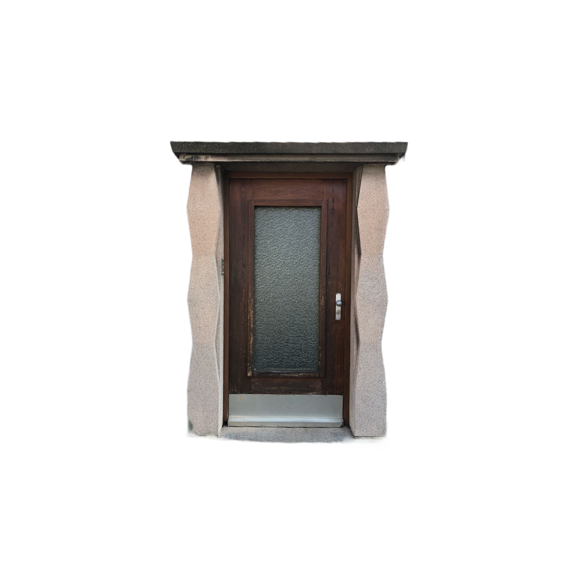
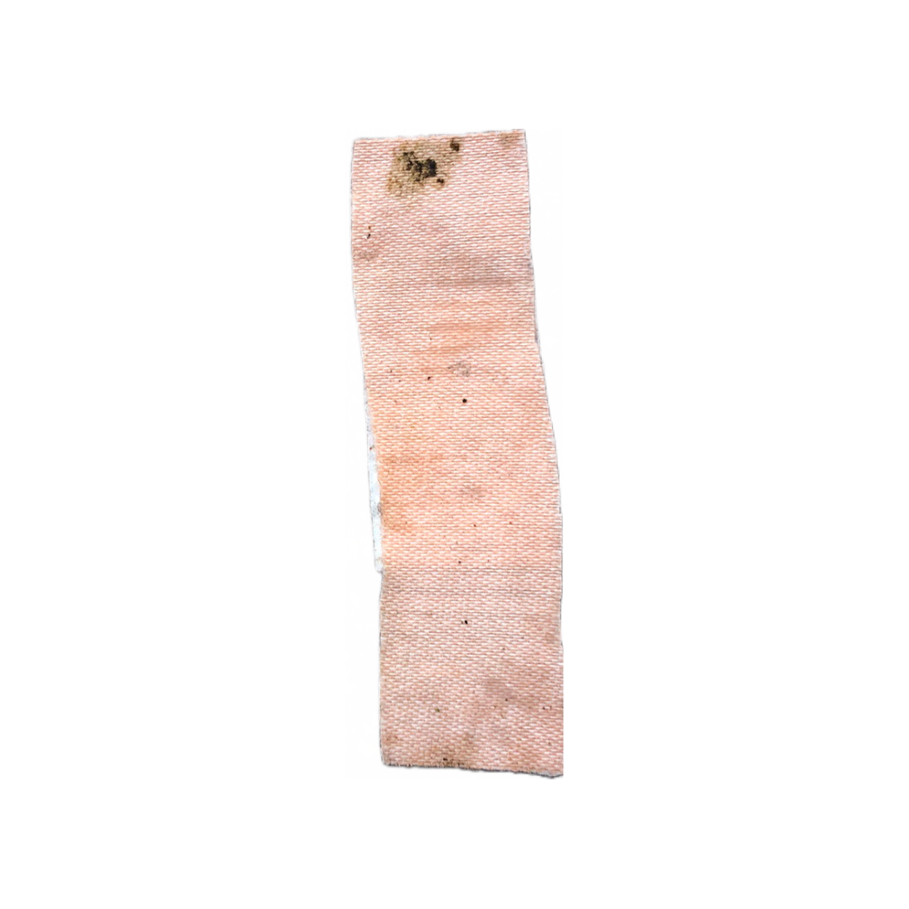
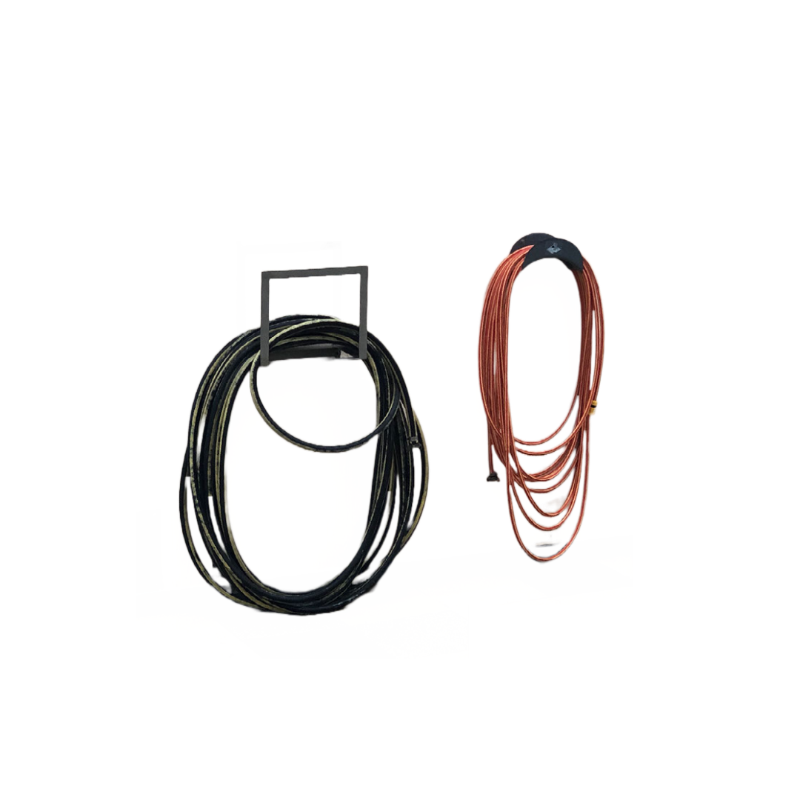

# Stuttgarter Kataster Architektur Projekt

## Beschreibung
Das Ziel dieses Repositories ist es, eine Website zu erstellen, auf der eine Galerie von architektonischen Aspekten Stuttgarts betrachtet werden kann.

(Ein Geschenk für Künstlerfreunde, für die die Künstlerische Gestaltung der Website möglicherweise nicht ausreicht, aber ich habe mein Bestes gegeben. Vielleicht nicht das Beste, aber über dem Durchschnitt hoffentlich.)

### Das Repository ist organisiert in die Folgende Art:

Hauptseite der Website:

* index.html 
* index2.html 

Inforomationseite der Website:

* info.html 

Fotos und entsprechender Code befinden sich hier:

* photos/photo#.html 
* photos/files/photo#.png

*** Wo kann man Aenderung machen? ***

Ich habe die Folgende Kommentare in den Code geschrieben, wo man darf Aenderungen machen. 

`<! -- HIER KANNST DU AENDERN  -->`

### Erweiterung Des Websites

Die Website kann erweitert werden, um weitere Fotos durch Bearbeiten des folgenden Codes einzubeziehen:

* index.html 
* index2.html 

1. Fügen Sie einfach mehr davon hinzu und ändern Sie den Code zur Fotodatei, sodass er dem Foto entspricht, das Sie anzeigen möchten.
```
	<div class="container">
		<a href="photos/photo5.html"></a>
		<a href="photos/photo6.html"></a>
		<a href="photos/photo7.html"></a>
		<a href="photos/photo8.html"></a>
	</div>
```

Geben Sie Folgendes in Ihren Computer ein: `bash container_gen.sh 9 20 > code.html`

Ich habe diesen Code so geschrieben, dass es Ihnen leichter fällt, die oben genannten Änderungen am Code durchzuführen. 

Sie können die Anzahl, die Sie benötigen, ändern. z.B können Sie die folgende Zeile im Code ändern, um eine Anzahl zwischen 9 und 20 zu wählen:


Dadurch können Code-snippets generiert werden, sodass Sie nicht jedes einzelne Teil selbst schreiben müssen. Sie finden den Code in "code.html" Es sollte da sein in den Ordner. 

* photos/generator.sh

2. Laden Sie diese Datei herunter und bearbeiten Sie sie auf Ihrem Computer.

```
#!/bin/bash

for i in {2..16} # HIER KANNST DU AENDERN
do
  # create HTML file with filename "photo<i>.html"
  echo '<!DOCTYPE html>
<html>
<head>
	<title>Photo 1</title>
	<style>
		body {
			background-color: #FFFFFF;
			font-family: Arial, sans-serif;
			text-align: center;
			margin: 0;
			padding: 0;
		}
		.photo {
			width: 100%;
			max-width: 800px;
			margin: 20px auto;
		}
		.description {
			font-size: 18px;
			font-weight: bold;
			margin: 20px 0;
			color: #000000;
		}
		.back-button {
			display: block;
			position: absolute;
			top: 0;
			left: 0;
			margin: 20px;
			color: #000000;
			border: none;
			padding: 10px 20px;
			font-size: 16px;
			cursor: pointer;
			text-decoration: none;
		}
		.back-arrow {
			display: inline-block;
			vertical-align: middle;
			margin-right: 10px;
			font-size: 24px;
		}
		.back-button:hover {
			color: #000000;
			text-decoration: underline;
		}
		
		/* Additional styles for the background color toggle */
		.toggle-button {
			display: block;
			position: absolute;
			top: 0;
			right: 0;
			margin: 20px;
			color: #000000;
			border: none;
			padding: 10px 20px;
			font-size: 16px;
			cursor: pointer;
			text-decoration: none;
		}
		.toggle-button:hover {
			color: #000000;
			text-decoration: underline;
		}
		
		/* Additional styles for dark mode */
		body.dark {
			background-color: #000000;
		}
		body.dark .description {
			color: #FFFFFF;
		}
		body.dark .back-button {
			color: #FFFFFF;
		}
		body.dark .back-button:hover {
			color: #FFFFFF;
		}
		body.dark .toggle-button {
			color: #FFFFFF;
		}
		body.dark .toggle-button:hover {
			color: #FFFFFF;
		}
	</style>
</head>
<body>
	<button class="toggle-button" onclick="toggleBackground()">Schwarz</button>
	
	<a href="../index.html" class="back-button"><span class="back-arrow">&lt;</span>BACK</a>
	
	
	
	<! -- HIER KANNST DU AENDERN  -->
	<div class="description">
		<p>ORT /// FUNKTION /// ZEIT</p> <! --schreib deine Beschreibung hier  -->
	</div>
	<! -- BIS HIER   -->
	
	<script>
		// Function to toggle background color
		function toggleBackground() {
			const body = document.querySelector("body");
			const toggleButton = document.querySelector(".toggle-button");
			
			if (body.classList.contains("dark")) {
				body.classList.remove("dark");
				toggleButton.innerText = "Schwarz";
			} else {
				body.classList.add("dark");
				toggleButton.innerText = "Weiß";
			}
		}
	</script>
</body>
</html>
' > photo"$i".html

done


```

Um den Code entsprechend der Anzahl Ihrer hochzuladenden Fotos anzupassen, müssen Sie lediglich die erste Zeile des Codes ändern: `for i in {2..8}`. 

Ersetzen Sie die Zahlen "2" und "8" durch die tatsächliche Anzahl Ihrer Fotos.

Führen Sie den Code aus, indem Sie einfach `bash generator.sh` in Ihr Terminal eingeben. 

Dadurch werden weitere Dateien generiert, die Webseiten für jedes Ihrer Fotos erstellen.

Laden Sie nun den generierten Code in den Ordner "Photos" hoch, damit die erstellten Webseiten dort abgerufen werden können.

### Wichtiger Hinweis

1. Wenn du willst Aenderungen machen und du hast eine Fehler gemacht, vergiss nie, dass Github speichert alle Aenderungen. Man kann immer zurueck gehen! 

2. Bash code can geoeffnet werden in Windows, genauso wie in Linux. Du kannst dein Bash code nur rennen, wenn alle Datei ist in dieselbe Ordner, du bist in, in dein Terminal. 


